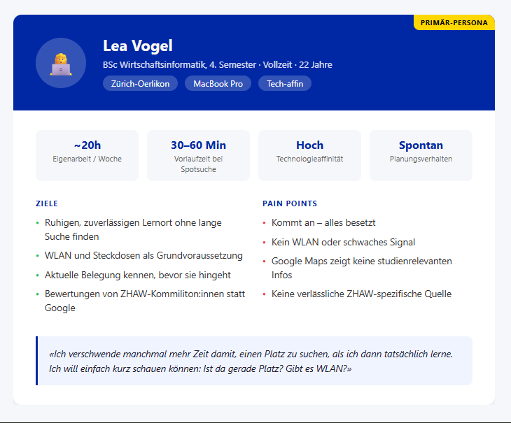
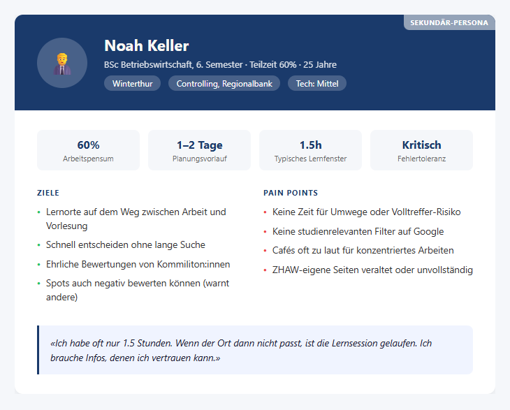
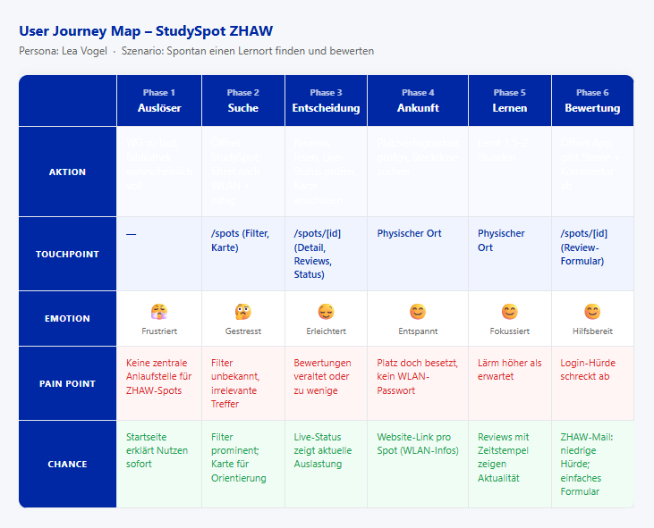
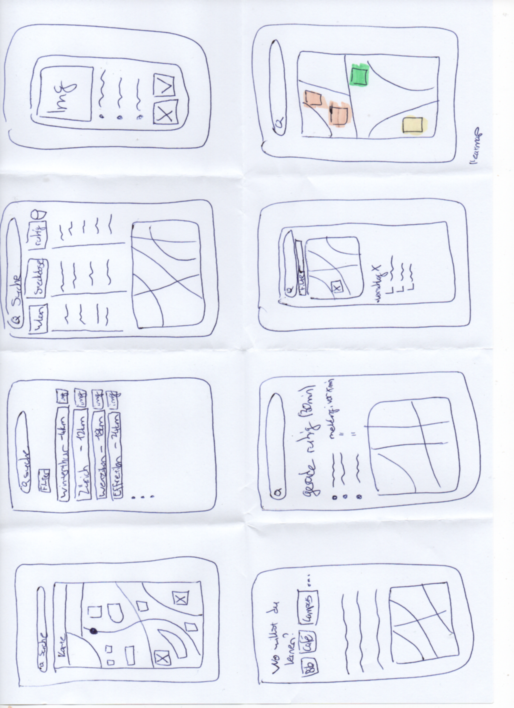
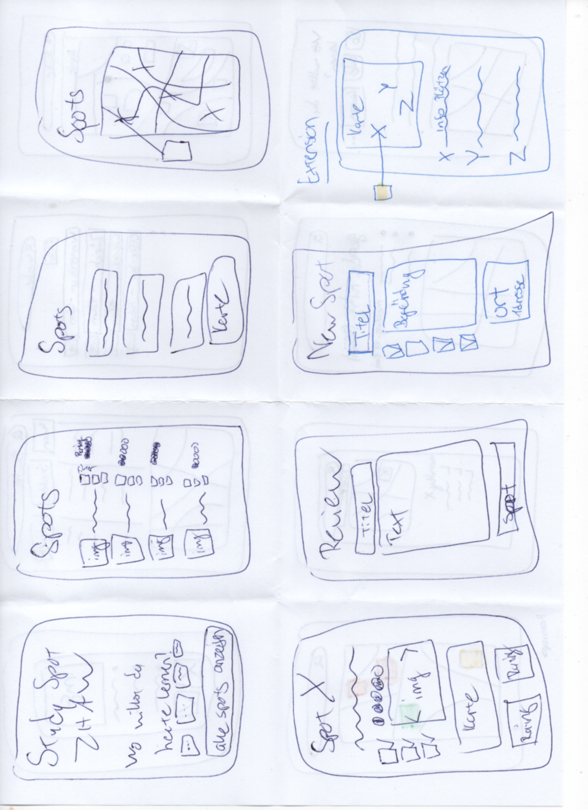
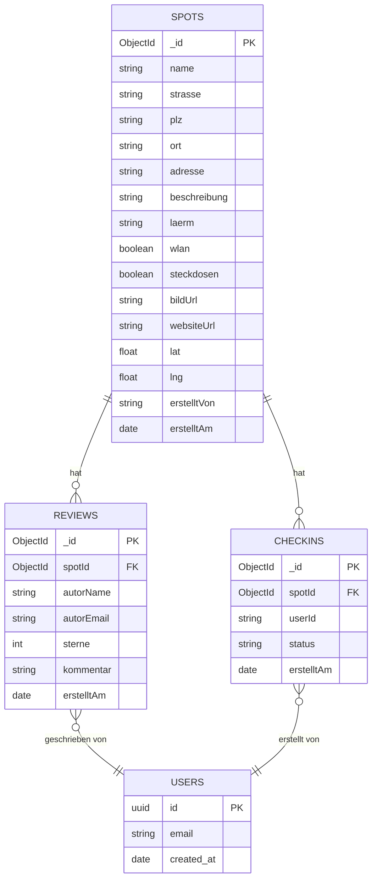
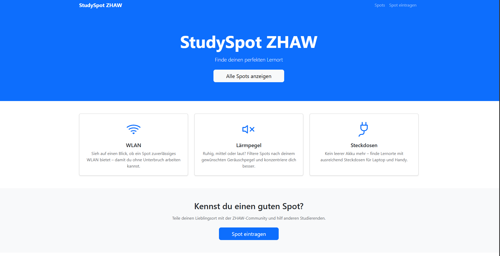
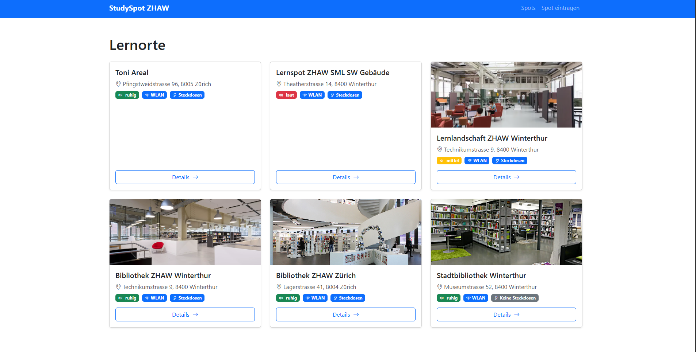
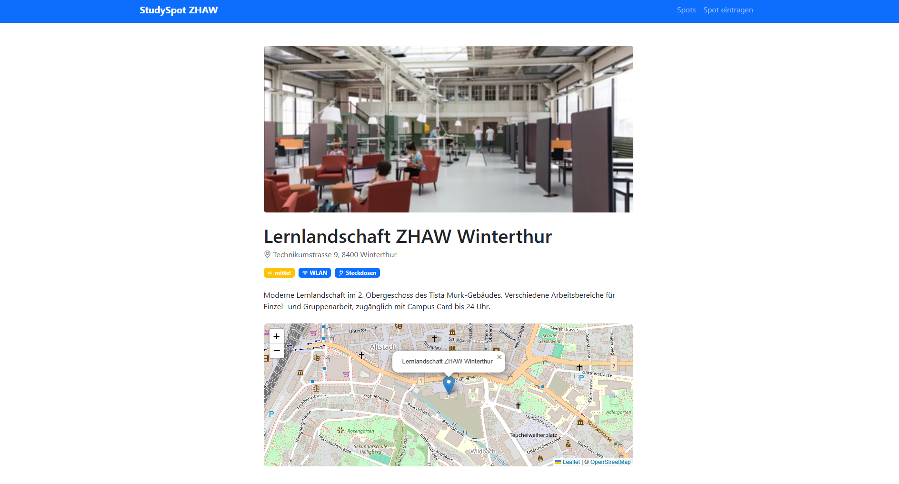
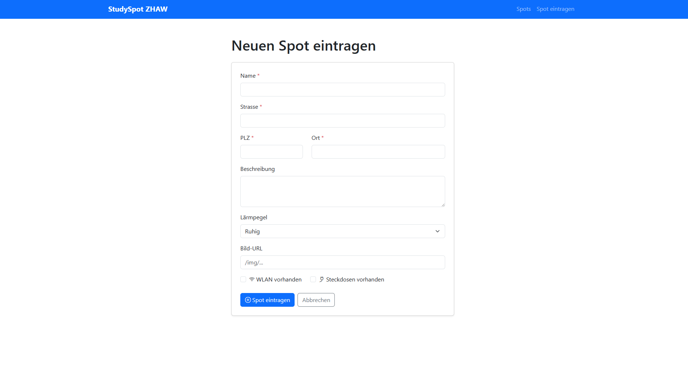

# StudySpot ZHAW

Eine Web-App für ZHAW-Studierende zum Finden und Bewerten von Lernorten. Community-getrieben, mit fokussierten Infos zu WLAN, Lärmpegel und aktueller Belegung.

> Modul: Prototyping, ZHAW Frühlingssemester 2026  
> Autor: Erion Rexhepi  
> Dozenten: Max Meisterhans, Mirella Moser

---

## Setup (lokal)

```bash
git clone https://github.com/rexheeri/studyspot-zhaw.git
cd studyspot-zhaw
npm install
cp .env.example .env   # MongoDB-URI und Supabase-Schlüssel in .env eintragen
npm run dev
```

Die App läuft danach auf http://localhost:5173

## Tech-Stack

| Bereich           | Tool          |
| ----------------- | ------------- |
| Framework         | SvelteKit     |
| Styling           | Bootstrap 5   |
| Datenbank         | MongoDB Atlas |
| Auth              | Supabase      |
| Hosting           | Netlify       |
| Versionskontrolle | Git / GitHub  |

---

## Inhaltsverzeichnis

1. [Ausgangslage](#1-ausgangslage)
2. [Lösungsidee](#2-lösungsidee)
3. [Vorgehen & Artefakte](#3-vorgehen--artefakte)
   1. [Understand & Define](#31-understand--define)
   2. [Sketch](#32-sketch)
   3. [Decide](#33-decide)
   4. [Prototype](#34-prototype)
   5. [Validate](#35-validate)
4. [Erweiterungen](#4-erweiterungen)
5. [Projektorganisation](#5-projektorganisation)
6. [KI-Deklaration](#6-ki-deklaration)
7. [Anhang](#7-anhang)

---

## 1. Ausgangslage

ZHAW-Studierende stehen regelmässig vor dem Problem, kurzfristig einen geeigneten Lernort zu finden. Bestehende Tools wie Google Maps zeigen zwar Cafés und Bibliotheken, blenden jedoch jene Informationen aus, die für konzentriertes Studieren entscheidend sind: Ist WLAN vorhanden? Wie laut ist es? Sind aktuell Plätze frei? Diese Lücke führt dazu, dass Studierende Zeit mit erfolglosem Suchen verlieren oder sich an überfüllten Standardorten wiederfinden. Eine dedizierte, community-getriebene Plattform für die ZHAW gibt es bisher nicht.

Das Ziel ist eine Web-App, auf der ZHAW-Studierende Lernorte erfassen, bewerten und nach studienrelevanten Kriterien filtern können. Die primäre Zielgruppe sind Studierende an den Standorten Winterthur und Zürich, indirekt profitieren auch Lernraumbetreiber von aktuellem Community-Feedback.

## 2. Lösungsidee

«StudySpot ZHAW» ist eine Web-App, auf der ZHAW-Studierende Lernorte erfassen, bewerten und filtern können. Im Zentrum steht die Filterbarkeit nach studienrelevanten Kriterien (WLAN, Lärmpegel, Belegung) sowie ein Sterne-Bewertungssystem mit Kommentaren. Nur Personen mit einer verifizierten ZHAW-Schulmail (`@zhaw.ch`) können sich registrieren und Inhalte beitragen, was die Plattform auf die ZHAW-Community beschränkt und die Qualität der Einträge sichert.

Die Kernfunktionen umfassen das Auflisten und Filtern von Spots, eine Detailseite je Spot mit interaktiver Karte, ein Review-System mit Sterne-Bewertung und Kommentar sowie das Erfassen neuer Spots via Formular. Die zugrundeliegende Annahme: Studierende sind bereit, Lernorte zu teilen und zu bewerten, solange der Aufwand gering ist. Die App erhebt keinen Anspruch auf Vollständigkeit und ersetzt keine Echtzeit-Belegungssensoren. Der Live-Status basiert auf Community-Meldungen und ist bewusst niedrigschwellig gehalten.

## 3. Vorgehen & Artefakte

### 3.1 Understand & Define

Um den Problemraum zu verstehen, wurde zunächst das eigene Nutzungsverhalten als ZHAW-Studierender reflektiert und mit Kommiliton:innen besprochen. Das Problem ist nicht das Finden von Lernorten überhaupt, sondern das Finden von _passenden_ Lernorten _kurzfristig_ ohne Umwege und ohne böse Überraschungen. Google Maps scheitert hier nicht an der Datenmenge, sondern an fehlender studienrelevanter Filterbarkeit.

Auf Basis dieser Analyse wurden zwei Personas erarbeitet.

**Primär-Persona: Lea Vogel, 22, BSc Wirtschaftsinformatik (Vollzeit)**

Lea studiert im Vollzeitmodell und plant wöchentlich rund 20 Stunden Eigenarbeit. Sie wohnt in einer lauten WG und ist deshalb auf externe Lernorte angewiesen. Die Entscheidung für einen Spot fällt spontan, meist 30 bis 60 Minuten vor dem Lernen. WLAN und Steckdosen sind für sie keine optionalen Features, sondern Grundvoraussetzung. Das Hauptproblem: Sie kommt an einem Ort an und alles ist besetzt. Was sie braucht, ist Verlässlichkeit. Sie will wissen, ob ein Ort jetzt gerade frei ist, bevor sie den Weg auf sich nimmt.

> «Ich verschwende manchmal mehr Zeit damit, einen Platz zu suchen, als ich dann tatsächlich lerne. Ich will einfach kurz schauen können: Ist da gerade Platz? Gibt es WLAN?»



**Sekundär-Persona: Noah Keller, 25, BSc Betriebswirtschaft (Teilzeit, 60%)**

Noah studiert berufsbegleitend und lernt in kurzen Zeitfenstern zwischen Arbeit und Vorlesungen. Eine Fehlinvestition von 30 Minuten für einen ungeeigneten Ort kann eine ganze Lernsession ruinieren. Er plant Lernorte wenn möglich ein bis zwei Tage im Voraus, schätzt klare Angaben auf einen Blick und hat wenig Geduld für Apps mit komplizierter Bedienung. Community-Bewertungen von Kommiliton:innen vertraut er deutlich mehr als generischen Google-Reviews.

> «Ich habe oft nur 1.5 Stunden. Wenn der Ort dann nicht passt, ist die Lernsession gelaufen. Ich brauche Infos, denen ich vertrauen kann.»



**User Journey Map**

Die Journey wurde für Leas Szenario «Spontan einen Lernort finden und danach bewerten» modelliert und umfasst sechs Phasen: Auslöser, Suche, Entscheidung, Ankunft, Lernen, Bewertung. Die Emotions-Kurve zeigt eine ausgeprägte Negativspitze beim Auslöser (Frustration über fehlende Alternativen) und nochmals in der Entscheidungsphase, wenn Infos fehlen oder veraltet sind. Sind die Daten nicht aktuell und vertrauenswürdig, bricht die Nutzerin die Suche ab oder geht ein Risiko ein.

Die wichtigste Erkenntnis: Live-Status ist kein Nice-to-have, sondern das Herzstück der App. Die grösste Nutzungsbarriere ist der vergebliche Weg. Wer weiss, ob ein Spot gerade «ruhig», «mittel» oder «voll» ist, kann eine fundierte Entscheidung treffen. Das ist der konkrete Mehrwert gegenüber Google Maps.

Eine zweite Erkenntnis betrifft den Moment der Bewertung: Die Bereitschaft zum Feedback ist direkt nach dem Spot-Besuch am höchsten. Der Review-CTA auf der Detailseite ist deshalb prominent platziert.



### 3.2 Sketch

In W9 wurden im Rahmen von Crazy-8s acht Lösungsvarianten für das Kernfeature «Spot finden» skizziert. Nach einer Bewertungsrunde anhand der Personas fiel die Wahl auf Variante 3 (Filter + Liste + Mini-Karte) mit Kategorien-Chips als Einstieg. Die Varianten 2 (Ampel-Karte) und 6 (Live-Status-Feed) flossen später als Erweiterungen in W12 ein.

Output: 16 Handskizzen (Crazy-8s, 2 Blätter) als Low-Fi-Vorlage für das Figma-Mockup.




### 3.3 Decide

Aus den acht Crazy-8s-Skizzen wurden drei Varianten als realistisch umsetzbar bewertet: eine Listenansicht mit Filterpanel (Variante 3), eine reine Kartenansicht mit farbcodierten Pins (Variante 2) und ein Live-Feed mit aktuellen Statusmeldungen nach Vorbild sozialer Plattformen (Variante 6).

Die Wahl fiel auf Variante 3, weil sie am direktesten auf das Kernbedürfnis beider Personas einzahlt: schnell und gezielt einen passenden Spot finden. Eine reine Kartenansicht setzt voraus, dass man sich räumlich gut orientieren kann und weiss, wo man sucht. Für Lea, die spontan und von unterwegs sucht, ist das oft nicht der Fall. Ein Live-Feed wäre ansprechend, aber ohne genug aktive Nutzende schnell leer und damit wertlos.

Variante 3 funktioniert auch mit wenigen Einträgen. Der Filtermechanismus macht die App sofort nützlich, ohne dass Nutzende die Orte bereits kennen müssen. Die Kartenvorschau pro Spot gibt räumliche Orientierung, ohne die ganze Oberfläche durch eine Karte zu dominieren.

Die Gesamtkarte (Mapbox GL JS mit allen Spot-Pins) wurde später als Erweiterung auf der /spots-Seite ergänzt, als optisches Komplement zur Liste, das Noahs Bedürfnis nach räumlicher Übersicht adressiert, ohne die primäre Listenstruktur aufzugeben.

Der Figma-Prototyp setzte Variante 3 als klickbaren Hi-Fi-Entwurf um und diente als direkte Vorlage für die technische Umsetzung in W11.

### 3.4 Prototype

#### 3.4.1 Entwurf (Design)

In W10 wurde auf Basis der W9-Wireframes ein klickbarer Hi-Fi-Prototyp in Figma erstellt. Der Prototyp umfasst 8 Screens (4 Desktop, 4 Mobile) und deckt folgende Workflows ab: Spot finden und bewerten, Filtern, Karten-Toggle und Spot erfassen.

[Figma-Prototyp öffnen](https://www.figma.com/design/naxGM6CVN7PpOZ6JGnyVzp/StudySpot-ZHAW)

Die Mockups entstanden für Desktop und Mobile (siehe Figma). Da der Usability-Test im Kleinklassen-Setting an Desktop-Rechnern lief, lag der Fokus der Umsetzung zuerst auf der Desktop-Ansicht. Über Bootstrap ist die App responsiv und funktioniert auch auf dem Handy; eine gezielte Mobile-Optimierung passend zu Leas Nutzung unterwegs ist der nächste logische Schritt.

#### 3.4.2 Umsetzung (Technik)

Das Projekt wurde mit SvelteKit umgesetzt und nutzt MongoDB Atlas als Datenbank. Das Styling basiert auf Bootstrap 5. Das Deployment läuft auf Netlify: bei jedem Push auf `main` wird automatisch ein neues Build ausgelöst.

Das Datenmodell besteht aus drei Collections in MongoDB sowie der Supabase-verwalteten USERS-Tabelle:



Die Collection `spots` enthält alle Lernorte mit den Feldern: name, strasse, plz, ort, adresse (zusammengesetzt), beschreibung, laerm (ruhig|mittel|laut), wlan, steckdosen, bildUrl, websiteUrl, lat, lng, erstelltVon und erstelltAm. Die Collection `reviews` speichert Bewertungen mit Referenz auf einen Spot, Sterne (1 bis 5), Kommentar und Autor. Die Collection `checkins` nimmt zeitlich begrenzte Statusmeldungen pro Spot auf und ist Grundlage für den Live-Belegungsstatus.

Die App nutzt SvelteKit File-Based Routing mit `+page.svelte` für die UI und `+page.server.js` für alle Datenbankzugriffe. Datenbankoperationen laufen ausschliesslich serverseitig; der MongoDB-URI wird nie an den Client übertragen. Die Verbindung wird in `src/lib/db.js` zentral verwaltet, mit dem nativen MongoDB Driver statt Mongoose. Diese Entscheidung wurde bewusst getroffen, um unnötige Abstraktion zu vermeiden und die Datenbankebene direkt zu halten.

In W11 wurden die Grundfunktionen implementiert: Spots auflisten, Spot-Detailseite, Spot erfassen via Form Action, Review abgeben via Form Action sowie eine interaktive Karte mit Geocoding via Nominatim. Statt Google Maps wurde Mapbox GL JS gewählt, da es ohne API-Key-Abrechnungsrisiko nutzbar ist und optisch überzeugend ist. Alle interaktiven Karten der App (Übersichtsseite, Detailseite und Adress-Vorschau im Erfassen-Formular) nutzen einheitlich Mapbox GL JS.

Live-URL: https://studyspot-zhaw.netlify.app/

### 3.5 Validate

URL der getesteten Version: https://studyspot-zhaw.netlify.app/ (Live-Deployment, Stand 20. Mai 2026; Screenshots im Anhang, Kap. 7)

Ziele der Prüfung:

1. Können Nutzerinnen und Nutzer ohne Erklärung einen passenden Lernort finden?
2. Ist der Prozess zum Erfassen eines neuen Spots intuitiv und fehlerfrei durchführbar?
3. Verstehen Nutzende den Review-Mechanismus und können sie eine Bewertung abgeben?
4. Helfen die verfügbaren Infos (WLAN, Lärm, Steckdosen) bei der Entscheidung, welchen Spot sie wählen?

Vorgehen: Moderierter Usability-Test, on-site (Kleinklassen-Übung W13, 20. Mai 2026). Die Testpersonen erhielten ein ausgedrucktes Aufgabenblatt mit je einer Aufgabe pro Abschnitt. Der Testleiter beobachtete still und griff erst nach ca. 30 Sekunden Inaktivität neutral ein («Was denkst du, was als nächstes zu tun wäre?»). Nach allen Aufgaben folgte eine kurze Nachbesprechung mit 5 offenen Fragen zu UX, Entscheidungshilfe und Nutzungsbereitschaft.

Stichprobe: 2 ZHAW-Studierende (Kommilitonen, Modul Prototyping), Desktop-Ansicht, Chrome-Browser. Die Stichprobengrösse von 2 Testpersonen war durch das Modul vorgegeben; der Test ist entsprechend qualitativ ausgelegt (Tiefe statt statistischer Repräsentativität).

**Aufgaben/Szenarien:**

| #   | Aufgabe                                                                                      | Testziel                           |
| --- | -------------------------------------------------------------------------------------------- | ---------------------------------- |
| 1   | «Du suchst einen ruhigen Lernort mit WLAN in Winterthur. Finde einen geeigneten Spot.»       | Navigation + Filterverständnis     |
| 2   | «Schau dir die Details des Spots ‹Stadtbibliothek Winterthur› an und gib eine Bewertung ab.» | Detailseite + Review-Formular      |
| 3   | «Du kennst einen guten Lernort, der noch nicht erfasst ist. Trag ihn in der App ein.»        | /spots/create – Formular-Usability |

**Beobachtungen:**

**P1 (Proband 1)**

- **U-01** _(Mittel)_ – Adresskarte erscheint im Create-Formular nicht automatisch; P1 unsicher ob Adresse korrekt gespeichert wurde.
- **U-02** _(Hoch)_ – Kein Adress-Autocomplete; P1 wünschte sich Vorschläge zur Validierung.
- **U-03** _(Hoch)_ – Keine Live-Belegungsanzeige; P1 nannte dies das wichtigste fehlende Feature.
- **U-04** _(Niedrig)_ – Wenige Einträge in der Spot-Liste; Content-Problem, kein UX-Bug.
- **U-05** _(Mittel)_ – Login-Beschränkung fehlt noch; P1 sah dies als wichtig für Vertrauen und Qualität.
- **U-06** _(Mittel)_ – Übersichtskarte mit allen Spot-Pins am Ende der Liste gewünscht.

**P2 (Proband 2)**

- **U-07** _(Niedrig)_ – Kein Website-Link pro Spot auf der Detailseite.
- **U-08** _(Hoch)_ – Öffnungszeiten fehlen vollständig; P2 bezeichnete dies als potenziellen Showstopper.
- **U-09** _(Niedrig)_ – Darkmode für nächtliche Lernphasen gewünscht (Nice-to-have).
- **U-10** _(Niedrig)_ – Empfehlungen für Cafés in der Nähe vorgeschlagen (Out-of-scope).

**Zusammenfassung:** Beide Testpersonen konnten die Kernfunktionen (Spot finden, Bewertung abgeben) ohne grosse Hürden durchführen. Die Grundnavigation und die Badge-Darstellung wurden als klar und verständlich bewertet. Die grössten Schwachstellen lagen im Spot-Erstellungsprozess (fehlende Adressvalidierung und Kartenvorschau, U-01/U-02) sowie in fehlenden Echtzeit-Informationen zur Belegung (U-03). Letzteres wurde von P2 als potenzieller Showstopper für den regulären Einsatz eingestuft.

**Abgeleitete Verbesserungen:**

| Priorität | Issue | Massnahme                                                                                 | Aufwand |
| --------- | ----- | ----------------------------------------------------------------------------------------- | ------- |
| 1         | U-02  | Adress-Autocomplete beim Spot-Erstellen (Nominatim-API)                                   | Mittel  |
| 2         | U-01  | Kartenvorschau im Create-Formular automatisch rendern, sobald Adressfeld verlassen wird   | Gering  |
| 3         | U-03  | Live-Statusmeldung «ruhig / mittel / voll» per Community-Check-in (verfällt nach 60 Min.) | Hoch    |
| 4         | U-06  | Übersichtskarte mit allen Spot-Pins am Ende der /spots-Seite                              | Gering  |
| 5         | U-08  | Öffnungszeiten-Feld in Datenbankschema und Detailseite ergänzen                           | Mittel  |
| 6         | U-05  | Supabase-Auth mit @zhaw.ch-Validierung                                                    | Hoch    |
| 7         | U-07  | Website-Link-Feld auf Detailseite                                                         | Gering  |

Issue U-08 (Öffnungszeiten) wurde trotz hoher Priorität bewusst zurückgestellt: Verlässliche Öffnungszeiten je Spot würden manuelle Pflege oder eine externe Datenquelle erfordern, was den Projektrahmen gesprengt hätte. Der Live-Status (U-03) deckt den dahinterliegenden Bedarf «Ist der Ort gerade nutzbar?» zumindest teilweise ab.

Issues U-09 (Darkmode) und U-10 (Läden in der Nähe) wurden nicht umgesetzt: zu weit ausserhalb des Projektfokus und zu geringer Nutzen für den Zeitaufwand.

Konkret umgesetzte Verbesserungen nach dem Test: siehe Kap. 4.

## 4. Erweiterungen

Alle nachfolgend beschriebenen Erweiterungen gehen über den Mindestumfang hinaus. Der Grossteil wurde direkt aus den Findings des Usability-Tests abgeleitet. Die App wurde nicht wahllos erweitert, sondern auf Basis echter Nutzungsprobleme verbessert.

**Supabase-Authentifizierung mit ZHAW-Mail-Validierung (aus U-05)**

Registrierung und Login laufen über Supabase Auth. Beim Registrieren wird die E-Mail-Adresse serverseitig geprüft: Nur Adressen mit der Domain `@zhaw.ch` werden akzeptiert, was sowohl Studierende (`@students.zhaw.ch`) als auch Dozierende und Mitarbeitende abdeckt. Nach der Registrierung wird eine Bestätigungsmail verschickt; erst nach Klick auf den Bestätigungslink ist das Konto aktiv. Geschützte Routen (Spot erfassen, Review abgeben, Spot bearbeiten) sind nur für eingeloggte Nutzende zugänglich. Der Login-Zustand wird per `+layout.server.js` und `hooks.server.js` auf jeder Seite geprüft.

**Adress-Autocomplete beim Spot-Erfassen (aus U-02)**

Beim Erfassen eines neuen Spots schlägt das Adressfeld während der Eingabe passende Adressen vor, basierend auf der Nominatim-API (OpenStreetMap). Sobald eine Adresse aus dem Dropdown gewählt wird, werden die Koordinaten automatisch gespeichert und die Kartenvorschau aktualisiert sich in Echtzeit. Das löst das in U-02 beobachtete Problem, dass Nutzende nicht wussten, ob ihre Adresse korrekt erfasst wurde.

**Live-Belegungsstatus (aus U-03)**

Jede Nutzerin und jeder Nutzer kann auf der Detailseite eines Spots melden, wie voll es gerade ist: «ruhig», «mittel» oder «voll». Meldungen verfallen nach 60 Minuten automatisch. Der angezeigte Status ist der Durchschnitt aller Meldungen im letzten Stundenfenster. Um Spam zu verhindern, gilt ein Rate-Limit von 15 Minuten pro Account und Spot. Auf der Übersichtsseite ist der aktuelle Status direkt in jeder Spot-Card als farbiges Badge sichtbar, ohne dass man zuerst die Detailseite öffnen muss.

**Belegungs-Filter auf der Übersichtsseite**

Die Spot-Liste auf `/spots` kann nach dem aktuellen Live-Status gefiltert werden: «Alle», «Ruhig», «Mittel» oder «Voll». Damit wird die differenzierende Funktion der App gegenüber Google Maps direkt beim Einstieg sichtbar.

**Spot bearbeiten (Admin-Edit)**

Der Projektersteller verfügt über einen einzelnen Admin-Account. Es gibt kein Mehrbenutzer-Rollensystem: Die Berechtigung wird serverseitig geprüft, indem die E-Mail-Adresse der eingeloggten Session mit der in der Umgebungsvariable `ADMIN_EMAIL` hinterlegten Adresse verglichen wird. Nur bei Übereinstimmung ist das Bearbeitungsformular unter `/spots/[id]/edit` zugänglich.

**Website-Link pro Spot (aus U-07)**

Jeder Spot kann einen Link zur offiziellen Website enthalten, z. B. zur ZHAW-Bibliotheksseite oder zur Reservierungsplattform. Der Link wird auf der Detailseite als klickbarer Button angezeigt.

**Mapbox-Übersichtskarte (aus U-06)**

Am unteren Ende der `/spots`-Seite zeigt eine interaktive Mapbox-GL-JS-Karte alle erfassten Spots als Pins. Ein Klick auf einen Pin öffnet die Detailseite des jeweiligen Spots. Die Karte gibt eine räumliche Übersicht und ist besonders nützlich für Nutzende wie Noah, die Spots auf dem Weg zwischen Arbeit und Campus suchen.

## 5. Projektorganisation

Die Projektarbeit ist in Arbeitspakete gegliedert (MVP → Extensions → Methodik-Artefakte → Deployment) und wird über den Git-Verlauf nachvollziehbar dokumentiert. GitHub Issues wurden ergänzend zur Kursstruktur genutzt.

Commit-Messages folgen dem Schema Conventional Commits (z.B. `feat:`, `fix:`, `chore:`, `docs:`).

Sessions und Zwischenstände werden parallel in einer `STATUS.md` festgehalten (lokales Arbeitsdokument, nicht im Repo).

Zur Datenbank-Sicherheit: Atlas Network Access ist bewusst auf `0.0.0.0/0` gesetzt, weil Netlify-Deployments ohne fixe IP-Adresse funktionieren und die Datenbank parallel in einem anderen Modul genutzt wird. Der Schutz erfolgt über ein autogeneriertes, langes Passwort des Datenbank-Users. Credentials liegen ausschliesslich in der lokalen `.env` (nicht im Repo) bzw. als Environment-Variable im Netlify-Dashboard.

## 6. KI-Deklaration

KI-Tools (primär Claude via Anthropic Cowork & Claude Code) wurden während des gesamten Projekts als Arbeits- und Lernhilfe eingesetzt. Der Einsatz lässt sich in
drei Bereiche gliedern:

**Projektorganisation und Planung**  
Claude diente als strukturgebender Assistent: Wochenplan besprechen,
Priorisierungen hinterfragen, Fortschritt tracken. Die Entscheidungen
(welche Extensions, welche Reihenfolge, wie stark abweichen vom Plan)
habe ich selbst getroffen, Claude hat sie kritisch begleitet und
blinde Flecken aufgezeigt.

**Code-Entwicklung**  
Beim Schreiben von Code habe ich KI als erfahrenen Reviewer eingesetzt:
Fehlermeldungen erklären lassen, Lösungsansätze diskutieren, bestehenden
Code auf Probleme prüfen. Eigenständig umgesetzte Teile (z. B.
MongoDB-Anbindung, SvelteKit-Routing, Supabase-Auth-Flow) wurden danach
mit KI-Unterstützung bereinigt und verbessert, aber nicht von Grund auf
generiert.

**Dokumentation**  
Bei der README hat KI geholfen, Formulierungen zu schärfen und die
Struktur einzuhalten. Die inhaltlichen Aussagen wie Personas, Beobachtungen
aus dem Usability-Test und Designentscheide stammen aus eigener Arbeit
und Reflexion.

## 7. Anhang

### Screenshots – Prototyp Stand 20. Mai 2026 (Usability-Test W13)

Die Screenshots zeigen den Zustand der App zum Zeitpunkt des Usability-Tests und dienen als Referenz für die in Kap. 3.5 dokumentierten Beobachtungen.

**Startseite (`/`)**  
  
_Hero-Bereich mit Call-to-Action, Feature-Übersicht und Link zum Spot erfassen._

**Spot-Übersicht (`/spots`)**  
  
_Grid-Ansicht aller Lernorte mit Badge-Darstellung (Lärmpegel, WLAN, Steckdosen) und Details-Button. Belegungs-Badge und Filter kamen erst nach dem Test dazu (siehe Kap. 4)._

**Spot-Detailseite (`/spots/[id]`)**  
  
_Detailseite mit Bild, Beschreibung, Badges und interaktiver Karte mit Spot-Marker._

**Spot erfassen (`/spots/create`)**  
  
_Formular zum Erfassen eines neuen Lernorts mit Pflichtfeldern, Lärmpegel-Dropdown und Checkboxen für WLAN und Steckdosen. Das Adress-Autocomplete kam erst nach dem Test dazu (siehe Kap. 4)._

---

_Weitere Artefakte: Persona-Profile (Kap. 3.1), User Journey Map (Kap. 3.1), Crazy-8s Wireframes (Kap. 3.2), ER-Diagramm (Kap. 3.4.2)._
